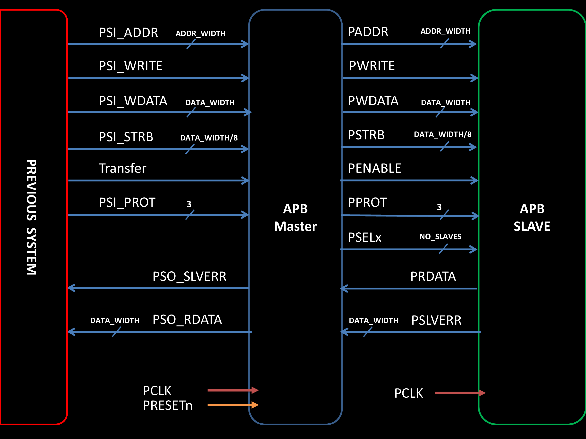

<p align="center">
  
</p>
<p align="center">
    <h1 align="center">DIGITAL DESIGN AND VERIFICATION OF AMBA_3&4_ APB PROTOCOL</h1>
</p>
<p align="center">
    <em>Language have been used</em>
</p>
<p align="center">
	
	
	
<p>
<p align="center">
		<em>Developed with the software and tools below.</em>
</p>
<p align="center">
	
	
	
</p>

<hr>

## 🔗 Quick Links

> - [📍 Overview](#-overview)
> - [📦 Features](#-features)
> - [📂 Repository Structure](#-repository-structure)
> - [🧩 Modules](#-modules)
> - [   Imge Architecture](#imge-architecture)
> - [🚀 Getting Started]()
>   - [⚙️ Installation]()
>   - [🤖 Running AMBA _3&4_ APB Protocol]()
> - [🤝 Contributing]()
> - [👏 Acknowledgments]()

---

## 📍 Overview

The AMBA bus protocol is a widely used on-chip interconnect specification for the connection and management of functional blocks in a System-on-Chip (SoC). The APB (Advanced Peripheral Bus) is a simpler bus protocol, which is used for connecting lower-bandwidth peripherals to the higher-performance main system bus.

This project aims to provide a comprehensive implementation and verification of the AMBA3 and AMBA4 APB protocols, including:

1. **Digital Design**: The digital design of the AMBA3 and AMBA4 APB bus interfaces, including the master, slave, and bridge components.
2. **Verification**: Thorough verification of the APB protocol implementation using SystemVerilog and the Verilog Hardware Description Language (HDL).

---

## 📦 Features

AMBA3 APB Protocol Features:

- PSLVERR: An error signal to indicate the failure of a transfer.
- PREADY: A ready signal to indicate completion of an APB transfer.

AMBA4 APB Protocol Features:

- PPROT: A protection signal to support both non-secure and secure transactions on APB.
- PSTRB: A write strobe signal to enable sparse data transfer on the write data bus.

---

## 📂 Repository Structure

```sh
└── Digital-Design-and-Verification-of-AMBA3-4-APB-Protocol/
    ├── Design
    │   └── APB_Master.v
    ├── Documents
    │   ├── AMBA3&4 APB Protocol Report.pdf
    │   ├── Design Architecture.pdf
    │   └── IHI0024C_amba_apb_protocol_spec.pdf
    ├── Quartus Snippet
    │   ├── FSM.png
    │   ├── Fmax.png
    │   ├── PCLK Period.png
    │   ├── RTL.png
    │   ├── hold summary.png
    │   └── setup summary.png
    ├── VERIFICATION
    │   ├── RTL
    │   │   ├── APB_Master.sv
    │   │   ├── APB_Master.sv.bak
    │   │   └── APB_SVA.sv
    │   ├── interface
    │   │   └── interface.sv
    │   ├── pkgs
    │   │   ├── Coverage_pkg.sv
    │   │   ├── Transaction_pkg.sv
    │   │   └── shared_pkg.sv
    │   ├── testbench
    │   │   └── testbench.sv
    │   └── top.sv
    ├── run_AMBA3.tcl
    └── run_AMBA4.tcl
```

---

## Imge Architecture



---

## 🧩 Modules

<details closed><summary>TCL</summary>

| File                                                                                                                                      | Summary                                   |
| ---                                                                                                                                       | ---                                       |
| [run_AMBA4.tcl](https://github.com/Abdelrahman1810/Digital-Design-and-Verification-of-AMBA3-4-APB-Protocol.git/blob/master/run_AMBA4.tcl) | `run_AMBA4.tcl` |
| [run_AMBA3.tcl](https://github.com/Abdelrahman1810/Digital-Design-and-Verification-of-AMBA3-4-APB-Protocol.git/blob/master/run_AMBA3.tcl) | `run_AMBA3.tcl` |

</details>

<details closed><summary>Design</summary>

| File                                                                                                                                           | Summary                                         |
| ---                                                                                                                                            | ---                                             |
| [APB_Master.v](https://github.com/Abdelrahman1810/Digital-Design-and-Verification-of-AMBA3-4-APB-Protocol.git/blob/master/Design/APB_Master.v) | `Design/APB_Master.v` |

</details>

<details closed><summary>VERIFICATION</summary>

| File                                                                                                                                     | Summary                                         |
| ---                                                                                                                                      | ---                                             |
| [top.sv](https://github.com/Abdelrahman1810/Digital-Design-and-Verification-of-AMBA3-4-APB-Protocol.git/blob/master/VERIFICATION/top.sv) | `VERIFICATION/top.sv` |

<details closed><summary>interface</summary>

| File                                                                                                                                                           | Summary                                                         |
| ---                                                                                                                                                            | ---                                                             |
| [interface.sv](https://github.com/Abdelrahman1810/Digital-Design-and-Verification-of-AMBA3-4-APB-Protocol.git/blob/master/VERIFICATION/interface/interface.sv) | `VERIFICATION/interface/interface.sv` |

</details>


<details closed><summary>testbench</summary>

| File                                                                                                                                                           | Summary                                                         |
| ---                                                                                                                                                            | ---                                                             |
| [testbench.sv](https://github.com/Abdelrahman1810/Digital-Design-and-Verification-of-AMBA3-4-APB-Protocol.git/blob/master/VERIFICATION/testbench/testbench.sv) | `VERIFICATION/testbench/testbench.sv` |

</details>

<details closed><summary>pkgs</summary>

| File                                                                                                                                                                  | Summary                                                          |
| ---                                                                                                                                                                   | ---                                                              |
| [Transaction_pkg.sv](https://github.com/Abdelrahman1810/Digital-Design-and-Verification-of-AMBA3-4-APB-Protocol.git/blob/master/VERIFICATION/pkgs/Transaction_pkg.sv) | `VERIFICATION/pkgs/Transaction_pkg.sv` |
| [Coverage_pkg.sv](https://github.com/Abdelrahman1810/Digital-Design-and-Verification-of-AMBA3-4-APB-Protocol.git/blob/master/VERIFICATION/pkgs/Coverage_pkg.sv)       | `VERIFICATION/pkgs/Coverage_pkg.sv`    |
| [shared_pkg.sv](https://github.com/Abdelrahman1810/Digital-Design-and-Verification-of-AMBA3-4-APB-Protocol.git/blob/master/VERIFICATION/pkgs/shared_pkg.sv)           | `VERIFICATION/pkgs/shared_pkg.sv`      |

</details>

<details closed><summary>RTL</summary>

| File                                                                                                                                                       | Summary                                                    |
| ---                                                                                                                                                        | ---                                                        |
| [APB_SVA.sv](https://github.com/Abdelrahman1810/Digital-Design-and-Verification-of-AMBA3-4-APB-Protocol.git/blob/master/VERIFICATION/RTL/APB_SVA.sv)       | `VERIFICATION/RTL/APB_SVA.sv`    |
| [APB_Master.sv](https://github.com/Abdelrahman1810/Digital-Design-and-Verification-of-AMBA3-4-APB-Protocol.git/blob/master/VERIFICATION/RTL/APB_Master.sv) | `VERIFICATION/RTL/APB_Master.sv` |

</details>

</details>


---

## 🚀 Getting Started

### Requirements
> [!IMPORTANT]
> Ensure you have the following dependencies installed on your system:
 
* **QuestaSim**: [download link](https://eda.sw.siemens.com/en-US/ic/questa/simulation/advanced-simulator/) 
* **Quartus**: [download link](https://www.intel.com/content/www/us/en/products/details/fpga/development-tools/quartus-prime/resource.html)
* **Any TesxtEditor (E.g VScode, sublime Text,..,etc)**: [VScode](https://code.visualstudio.com/Download), [sublime](https://www.sublimetext.com/download)

###  Installation

1. Clone the repository:

    ```sh
    git clone https://github.com/Abdelrahman1810/Digital-Design-and-Verification-of-AMBA3-4-APB-Protocol.git
    ```

###  Running AMBA _3&4_ APB Protocol

1. Make new project in Questa 

    ```sh
    file -> new Project
    ```

2. add path where the repository in

3. run this comand in Questa transcript to simulate AMBA_3_ APB

   ```ruby
   do run_AMBA3.tcl
   ```
4. run this comand in Questa transcript to simulate AMBA_4_ APB

   ```ruby
   do run_AMBA4.tcl
   ```

---

##  🤝 Contributing

If you find any issues or have suggestions for improvement, feel free to submit a pull request or open an issue in the repository. Contributions are always welcome!

<details closed>
    <summary>Contributing Guidelines</summary>

1. **Fork the Repository**: Start by forking the project repository to your GitHub account.
2. **Clone Locally**: Clone the forked repository to your local machine using a Git client.
   ```sh
   git clone https://github.com/Abdelrahman1810/Digital-Design-and-Verification-of-AMBA3-4-APB-Protocol.git
   ```
3. **Create a New Branch**: Always work on a new branch, giving it a descriptive name.
   ```sh
   git checkout -b new-feature-x
   ```
4. **Make Your Changes**: Develop and test your changes locally.
5. **Commit Your Changes**: Commit with a clear message describing your updates.
   ```sh
   git commit -m 'Implemented new feature x.'
   ```
6. **Push to GitHub**: Push the changes to your forked repository.
   ```sh
   git push origin new-feature-x
   ```
7. **Submit a Pull Request**: Create a PR against the original project repository. Clearly describe the changes and their motivations.

Once your PR is reviewed and approved, it will be merged into the main branch.

</details>

---


## 👏 Acknowledgments

- [IHI0024C_amba_apb_protocol_spec](https://www.eecs.umich.edu/courses/eecs373/readings/IHI0024C_amba_apb_protocol_spec.pdf).

---

## Contact info

<a href="https://linktr.ee/A_Hassanen" target="_blank">
  
</a> 
<br>
<br>
<br>


[**Return**](#-quick-links)